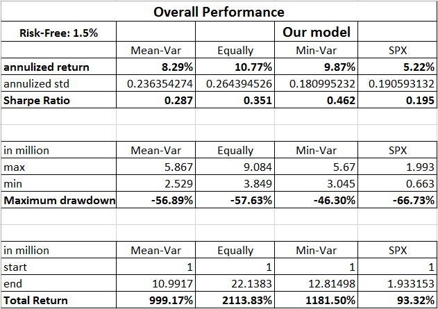

# Dynamic-Stock-Recommendation-Machine_Learning

## First Author: Published paper on IEEE TrustCom 2018 (http://www.cloud-conf.net/trustcom18/)
Hongyang Yang, Xiao-Yang Liu, Qingwei W. A Practical Machine Learning Approach for Dynamic Stock Recommendation. IEEE TrustCom 2018. 

## Abstract: 
Stock recommendation is vital to investment companies and investors. However, no single stock selection strategy will always win while analysts may not have enough time to check all S&P 500 stocks (the Standard & Poor’s 500). In this paper, we propose a practical scheme that recommends stocks from S&P 500 using machine learning. Our basic idea is to buy and hold the top 20% stocks dynamically. First, we select representative stock indicators with good explanatory power. Secondly, we take five frequently used machine learning methods, including linear regression, ridge regression, stepwise regression, random forest and generalized boosted regression, to model stock indicators and quarterly log-return in a rolling window. Thirdly, we choose the model with the lowest Mean Square Error in each period to rank stocks. Finally, we test the selected stocks by conducting portfolio allocation methods such as equally weighted, mean- variance, and minimum-variance. Our empirical results show that the proposed scheme outperforms the long-only strategy on the S&P 500 index in terms of Sharpe ratio and cumulative returns.

## Index Term: 
Stock recommendation, fundamental value investing, machine learning, model selection, risk management

## Project summary：
+ We developed a practical approach to using machine-learning methods selecting S&P 500 stocks based on financial ratios (e.g., EPS, ROA, ROE, etc). Outperformed the S&P 500 index on out of sample data, achieved a Sharpe ratio of 0.5 (0.19 on SPX).
+ We performed feature selection by 11 GICS sectors based on a rolling window to choose the lowest MSE model among Linear Regression, Stepwise Regression, Regression with Ridge, Random Forest, and GBM. Applied a model ensemble method.

## Data: 
Retrieved from __WRDS (Wharton Research Data Services)__, Compustat Industrial [daily and quarterly Data]

+ __S&P 500 Fundamental Quarterly Data__ ([fundamental_final_table.xlsx](Data/fundamental_final_table.xlsx))
  + Database: Compustat North America (Fundamentals Quarterly) and (Index Constituents)
  + Timeline: 27 years (1990-2017)
  + Tickers: 1193 stock (all historical S&P 500 component stocks)
  + Value: 20 financial ratios calculated from raw accouting report data

+ __S&P 500 Historical Component Stocks Adjusted Daily Price__ ([1-sp500_adj_price.csv.zip](Data/1-sp500_adj_price.csv.zip))
  + Database: Compustat North America (Security Daily)
  + Timeline: 27 years (1990-2017)
  + Tickers: 1193 stock (all historical S&P 500 component stocks)
  + Value: Adjusted Daily Close Price
  
+ __S&P 500 Index Daily Price__ ([1-spx_price.xlsx](Data/1-spx_price.xlsx))
  + Database: Yahoo Finance
  + Timeline: 27 years (1990-2017)
  + Tickers: SPX
  + Value: Adjusted Daily Close Price
  
## Model:
This project includes 3 models: 
+ __Focasting Model__: Machine Learning Algorithms implemented in R
+ __Portfolio Allocation Model__: Mean-Variance & Minimum-Variance implemented in Matlab
+ __Back-testing Model__: Calculated in-sample & out-of-sample Sharpe Ratio in Python

### __Focasting Model__:
+ __Input__: 11 Excel files of cleaned data about fundamental data (sector 10-Energy, sector 15-Materials, sector 20-Industrials, sector 25-Consumer Discretionary, sector 30-Consumer Staples, sector 35-Health Care, sector 40-Financials, sector 45-Information Technology, sector 50-Telecommunication Services, sector 55-Utilities, sector 60-Real Estate)
+ __Script__: (
  + [fundamental_run_model.R](1_Forcasting_model/fundamental_run_model.R): The main function to run the forecasting model
  + [fundamental_ML_model.R](1_Forcasting_model/fundamental_ML_model.R): The forecasting function (cornerstone of this project) 
   + Model Outputs: 
    1. model test error to select models
    2. trade period predicted return to select stocks
    3. linear regression features
    4. random forest features
    5. ridge features
    6. stepwise regression features
    7. gbm features
  + [fundamental_select_stock.R](1_Forcasting_model/fundamental_select_stock.R)
+ __Output__:

### __Portfolio Allocation Model__:

### __Back-testing Model__:

